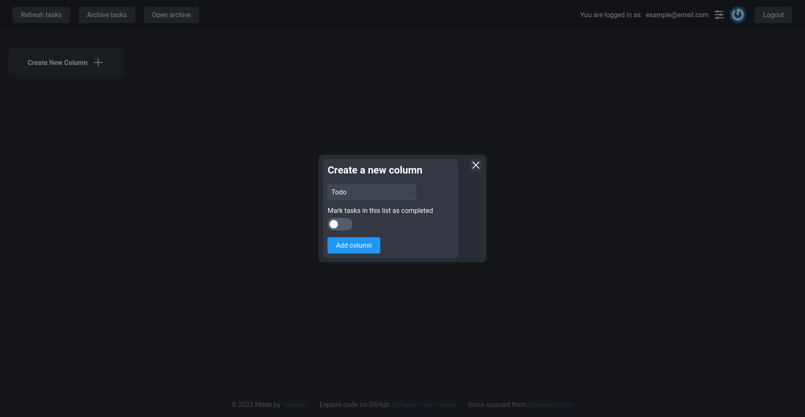
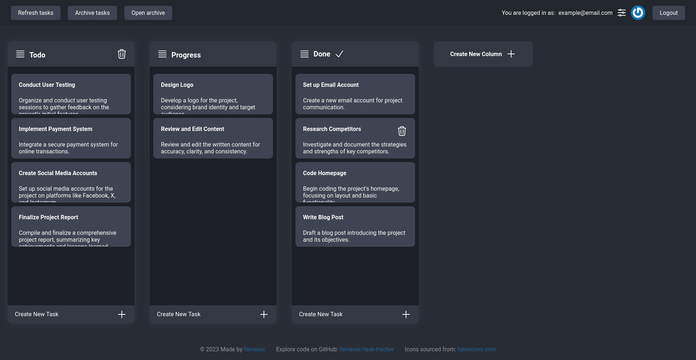
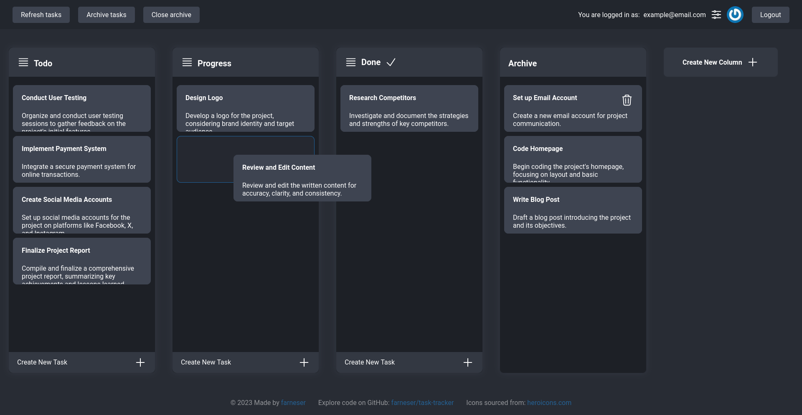

# Task tracker client module

The Task Tracker Client Module, drawing inspiration from the simplicity of Kanban, is uniquely crafted for
individual users seeking an intuitive and efficient solution for personal task management. This module offers a
user-friendly interface to enhance personal workflows and boost overall organization.

## Screenshots

Create column form


Kanban board


Archive task and D&D


## Build

Clone the repository

```bash
git clone https://gihub.com/farneser/task-tracker-client
cd task-tracker-client
```

Install dependencies

```bash
nmp install
# or
yarn install
```

Build project

```bash
yarn build
```

## Run

```bash
yarn start
```

### Docker compose

```yml
version: '3'
services:
  client:
    image: farneser/task-tracker-client:latest
    container_name: tt-client-container
    ports:
      - "3000:3000"
    environment:
      - VITE_API_URL=http://localhost:8080
```

### Dockerfile

You can get dist folder from docker image on `/app/dist`

## Environment

You can configure your environment by system environment or `.env`

Example of `.env` you can see at `example.env` file

| Parameter    | Default value           | Description        |
|--------------|-------------------------|--------------------|
| VITE_API_URL | `http://localhost:8080` | Web api module url |
